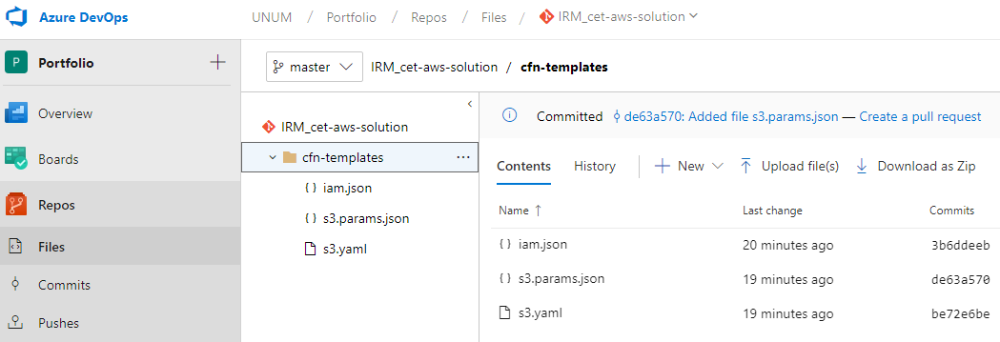

## AWS Solution Gate Check Process

 - You will need an EE Azure DevOps repo
	 - create a top level folder named `cfn-templates`
	 - create [CloudFormation](https://aws.amazon.com/cloudformation/) templates in the `cf-templates` folder that will deploy your AWS solution

    

